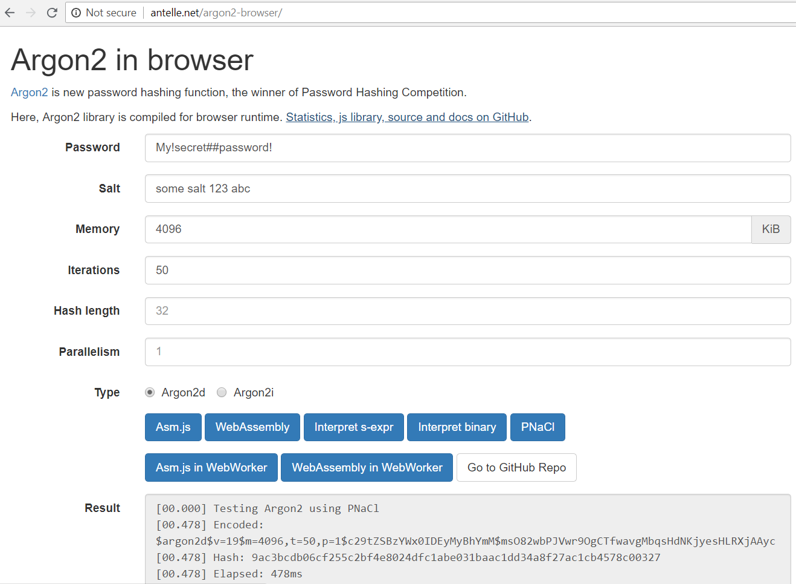

# Argon2

[**Argon2**](https://en.wikipedia.org/wiki/Argon2) is modern **ASIC-resistant** and **GPU-resistant** secure key derivation function. It has better password cracking resistance \(when configured correctly\) than **PBKDF2**, **Bcrypt** and **Scrypt** \(for similar configuration parameters for CPU and RAM usage\).

## Variants of Argon2

The **Argon2** function has several variants:

* **Argon2d** – provides strong GPU resistance, but has potential side-channel attacks \(possible in very special situations\).
* **Argon2i** – provides less GPU resistance, but has no side-channel attacks.
* **Argon2id** – **recommended** \(combines the Argon2d and Argon2i\).

## Config Parameters of Argon2

**Argon2** has the following **config parameters**, which are very similar to Scrypt:

* **password** `P`: the password \(or message\) to be hashed
* **salt** `S`: random-generated salt \(16 bytes recommended for password hashing\)
* **iterations** `t`: number of iterations to perform
* **memorySizeKB** `m`: amount of memory \(in kilobytes\) to use
* **parallelism** `p`: degree of parallelism \(i.e. number of threads\)
* **outputKeyLength** `T`: desired number of returned bytes

## Argon2 - Example

You can **play with the Argon2** password to key derivation function online here: [http://antelle.net/argon2-browser](http://antelle.net/argon2-browser).



## Argon2 Calculation in Python - Example

Now, we shall write some **code in Python** to derive a key from a password using the **Argon2** algorithm.

First, install the Python package `argon2_cffi` using the command:

```text
pip install argon2_cffi
```

Now, write the Python code to calculate Argon2:

```python
import argon2, binascii

hash = argon2.hash_password_raw(
    time_cost=16, memory_cost=2**15, parallelism=2, hash_len=32,
    password=b'password', salt=b'some salt', type=argon2.low_level.Type.ID)
print("Argon2 raw hash:", binascii.hexlify(hash))

argon2Hasher = argon2.PasswordHasher(
    time_cost=16, memory_cost=2**15, parallelism=2, hash_len=32, salt_len=16)
hash = argon2Hasher.hash("password")
print("Argon2 hash (random salt):", hash)

verifyValid = argon2Hasher.verify(hash, "password")
print("Argon2 verify (correct password):", verifyValid)

try:
    argon2Hasher.verify(hash, "wrong123")
except:
    print("Argon2 verify (incorrect password):", False)
```

Run the above code example: [ ](https://repl.it/@nakov/Argon2)[https://repl.it/@nakov/Argon2-in-Python](https://repl.it/@nakov/Argon2-in-Python).

The above code first derives a "**raw hash**" \(256-bit key\), which is argon2-based key derivation, just like with scrypt. It also derives a "**argon2 hash**", which holds the algorithm parameters, along with random salt and derived key. The later is used for password storing and verification. Finally, the calculated hashes are tested agains a correct and wrong password.

The **Argon2** calculation takes several **input configuration settings**: **time\_cost** \(number of iterations\), **memory\_cost** \(memory to use in KB\), **parallelism** \(how many parallel threads to use\), **hash\_len** \(the size of the derived key\), **salt\_len** \(the size of the random generated salt, typically 128 bits / 16 bytes\).

Sample **output** from the above code execution:

```text
Argon2 raw hash: b'157f21dd3fdf7bafb76d2923ccaffa0b7be7cbae394709474d2bc66ee7b09d3e'
Argon2 hash (random salt): $argon2id$v=19$m=32768,t=16,p=2$Rfy6J41W9idBU+n/8sZc6Q$i3QYYPtoogIAw78I2qqlUQ8vjzUXGG1V6QsBOq2NIp4
Argon2 verify (correct password): True
Argon2 verify (incorrect password): False
```

Note that the **argon2 hash** in the above output is written in a standardized format, which holds the Argon2 algorithm config **parameters** + the derived **key** + the random **salt**. By design, the salt and the derived key _should be different at each code execution_.

Try to **execute the above code several times** to ensure that the **derived key** will be the same \(because the salt is fixed\) and the derived **argon2 hash** will be different at each execution \(because a random salt is generated internally by the algorithm\).

Try to change the **time\_cost** or the **memory\_cost** settings and see how they affect the **execution time** for the key derivation.

## Storing Algorithm Settings + Salt + Hash Together

In many applications, frameworks and tools, **Argon2 encrypted passwords are stored together with the algorithm settings and salt**, into a single string \(in certain format, like it was shown above\), consisting of several parts, separated by `$` character. For example, the password `p@ss~123` can be stored in the Argon2 standard format like this \(several examples are given, to make the pattern apparent\):

```text
$argon2d$v=19$m=1024,t=16,p=4$c2FsdDEyM3NhbHQxMjM$2dVtFVPCezhvjtyu2PaeXOeBR+RUZ6SqhtD/+QF4F1o
$argon2d$v=19$m=1024,t=16,p=4$YW5vdGhlcnNhbHRhbm90aGVyc2FsdA$KB7Nj7kK21YdGeEBQy7R3vKkYCz1cdR/I3QcArMhl/Q
$argon2i$v=19$m=8192,t=32,p=1$c21hbGxzYWx0$lmO1aPPy3x0CcvrKpFLi1TL/uSVJ/eO5hPHiWZFaWvY
```

All the above hashes hold the same password, but with different algotihm settings and different salt.

## When to Use Argon2?

When configured properly **Argon2** is considered a highly secure KDF function, **one of the best** available in the industry, so you can use it as general purpose password to key derivation algorithm, e.g. to when encrypting wallets, documents, files or app passwords. In the general case **Argon2 is recommended** over **Scrypt**, **Bcrypt** and **PBKDF2**.

