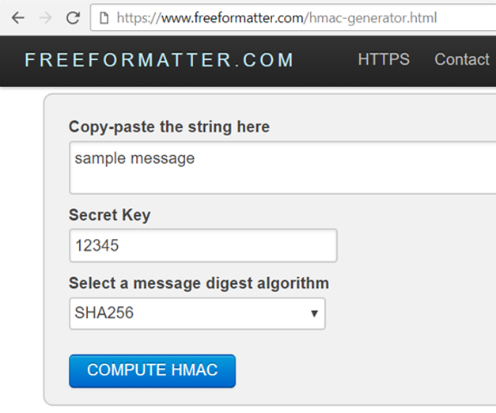

# HMAC and Key Derivation

Simply calculating `hash_func(key + msg)` to obtain a MAC \(message authentication code\) is considered **insecure** \(see the [details](https://en.wikipedia.org/wiki/HMAC#Design_principles)\). It is recommended to use the **HMAC algorithm instead**, e.g. `HMAC-SHA256` or `HMAC-SHA3-512` or other secure MAC algorithm.

## What is HMAC?

[**HMAC**](https://en.wikipedia.org/wiki/HMAC) = **H**ash-based **M**essage **A**uthentication **C**ode \(MAC code, calculated using a cryptographic hash function\):

```text
HMAC(key, msg, hash_func) -> hash
```

The results MAC code is a **message hash** mixed with a secret key. It has the cryptographic properties of hashes: **irreversible**, **collision resistant**, etc.

The `hash_func` can be any cryptographic hash function like `SHA-256`, `SHA-512`, `RIPEMD-160`, `SHA3-256` or `BLAKE2s`.

**HMAC** is used for message **authenticity**, message **integrity** and sometimes for **key derivation**.

## Key Derivation Functions \(KDF\)

**Key derivation function** \(KDF\) is a function which transforms a variable-length password to fixed-length key \(sequence of bits\):

```text
function(password) -> key
```

As **very simple KDF function**, we can use SHA256: just hash the password. Don't do this, because it is **insecure**. Simple hashes are vulnerable to **dictionary attacks**.

As more complicated KDF function, you can derive a password by calculating **HMAC\(salt, msg, SHA256\)** using some random value called "**salt**", which is stored along with the derived key and used later to derive the same key again from the password.

Using **HKDF \(HMAC-based key derivation\)** for key derivation is **less secure** than modern KDFs, so experts recommend using stronger key derivation functions like [PBKDF2](https://en.wikipedia.org/wiki/PBKDF2), [Bcrypt](https://en.wikipedia.org/wiki/Bcrypt), [Scrypt](https://en.wikipedia.org/wiki/Scrypt) and [Argon2](https://en.wikipedia.org/wiki/Argon2). We shall discuss all these KDF functions later.

## HMAC Calculation - Example

To get a better idea of **HMAC** and how it is calculated, try this online tool: [https://www.freeformatter.com/hmac-generator.html](https://www.freeformatter.com/hmac-generator.html)



Play with calculating **HMAC\('sample message', '12345', 'SHA256'\)**:

```text
HMAC('sample message', '12345', 'SHA256') =
  'ee40ca7bc90df844d2f5b5667b27361a2350fad99352d8a6ce061c69e41e5d32'
```

Try the above example yourself.

