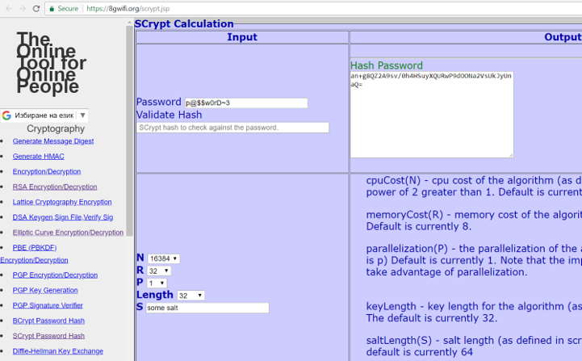

# Scrypt

[**Scrypt**](https://en.wikipedia.org/wiki/Scrypt) \([RFC 7914](https://tools.ietf.org/html/rfc7914.html)\) is a strong cryptographic key-derivation function \(KDF\). It is memory-intensive, designed to prevent **GPU**, **ASIC** and **FPGA** attacks \(highly efficient password cracking hardware\).

The **Scrypt** algorithm takes several **input parameters** and produces the derived **key** as output:

```text
key = Scrypt(password, salt, N, r, p, derived-key-len)
```

## Scrypt Parameters

The **Scrypt config parameters** are:

* `N` – iterations count \(affects memory and CPU usage\), e.g. 16384 or 2048
* `r` – block size \(affects memory and CPU usage\), e.g. 8
* `p` – parallelism factor \(threads to run in parallel - affects the memory, CPU usage\), usually 1
* `password`– the input password \(8-10 chars minimal length is recommended\)
* `salt` – securely-generated random bytes \(64 bits minimum, 128 bits recommended\)
* `derived-key-length` - how many bytes to generate as output, e.g. 32 bytes \(256 bits\)

The **memory** in Scrypt is accessed in strongly **dependent order** at each step, so the memory access speed is the algorithm's bottleneck. The **memory required** to compute Scrypt key derivation is calculated as follows:

```text
Memory required = 128 * N * r * p bytes
```

Example: e.g. 128 \* N \* r \* p = 128 \* 16384 \* 8 \* 1 = 16 MB  
\(or 128 \* N \* r \* p = 128 \* 2048 \* 8 \* 1 = 2 MB\)

**Choosing parameters** depends on how much you want to wait and what level of security \(password cracking resistance\) do you want to achieve:

* Sample parameters for **interactive login**: N=16384, r=8, p=1 \(RAM = 2 MB\). For interactive login you most probably do not want to wait more than a 0.5 seconds, so the computations should be very slow. Also at the server side, it is usual that many users can login in the same time, so slow Scrypt computation will slow down the entire system.
* Sample parameters for **file encryption**: N=1048576, r=8, p=1 \(RAM = 1 GB\). When you encrypt your hard drive, you will unlock the encrypted data in rare cases, usually not more than 2-3 times per day, so you may want to wait for 2-3 seconds to increase the security.

You can perform tests and choose the Scrypt parameters yourself during the design and development of your app or system. Always try to use the **fastest possible implementation of Scrypt** for your language and platform, because crackers will definitely use it. Some implementations \(e.g. in Python\) may be 100 times slower than the fastest ones!

In the **MyEtherWallet** crypto wallet, the default Scrypt parameters are N=8192, r=8, p=1. These settings are not strong enough for crypto wallets, but this is how it works. The solution is to use long and complex password to avoid password cracking attacks.

## Scrypt - Example

You can play with **Scrypt** key derivation online here: [https://8gwifi.org/scrypt.jsp](https://8gwifi.org/scrypt.jsp).



## Scrypt Calculation in Python - Example

Now, we shall write some **code in Python** to derive a key from a password using the **Scrypt** algorithm.

First, install the Python package `scrypt` using the command:

```text
pip install scrypt
```

Note that the `scrypt` package depends on OpenSSL, so first install it in its default location \(e.g. in `C:\OpenSSL-Win64` in Windows\), then install the **scrypt** Python package.

Now, after the `scrypt` package is successfully installed, write the Python code to calculate a Scrypt hash:  
\(_Note, we have chosen smaller number for iterations count. We did that just to increase the following example execution speed. In common usage, a higher iterations count is recommended, e.g. 16384 - see above._\)

```python
import pyscrypt

salt = b'aa1f2d3f4d23ac44e9c5a6c3d8f9ee8c'
passwd = b'p@$Sw0rD~7'
key = pyscrypt.hash(passwd, salt, 2048, 8, 1, 32)
print("Derived key:", key.hex())
```

Run the above code example: [https://repl.it/@nakov/Scrypt-in-Python](https://repl.it/@nakov/Scrypt-in-Python).

The **Scrypt** calculation function takes several **input parameters**: the **password** \(bytes sequence\), the **salt** \(bytes sequence\), **iterations** count, **block size** for each iteration, **parallelism** factor and the output **key length** \(number of bytes for the derived key\).

The **output** from the above code execution is the following:

```text
Derived key: b'e813a6f6ccc4e9110193bf9efb7c0a489d76655f9e36629dccbeaf2a73bc0c6f'
```

Try to change the number of **iterations** or the **block size** and see how they affect the **execution time**. Have in mind that the above Python implementation is not very fast. You may find fast Scrypt implementation in Internet.

## Storing Algorithm Settings + Salt + Hash Together

In many applications, frameworks and tools, **Scrypt encrypted passwords are stored together with the algorithm settings and salt**, into a single string \(in certain format\), consisting of several parts, separated by `$` character. For example, the password `p@ss~123` can be stored in the Scrypt standard format like this \(several examples are given, to make the pattern apparent\):

```text
16384$8$1$kytG1MHY1KU=$afc338d494dc89be40e317788e3cd9166d066709db0e6481f0801bd918710f46
16384$8$1$5gFGlElztY0=$560f6229356c281a525fad4e2fc4c209bb55c21dec789381335a32bb84888a5a
32768$8$4$VGhlIHF1aWo=$54d657cec8b3aaca675b407e790bccf1dddb0a23665cd5f994820a736d4b58ba
```

## When to Use Scrypt?

When configured properly **Scrypt** is considered a highly secure KDF function, so you can use it as general purpose password to key derivation algorithm, e.g. when encrypting wallets, files or app passwords.

