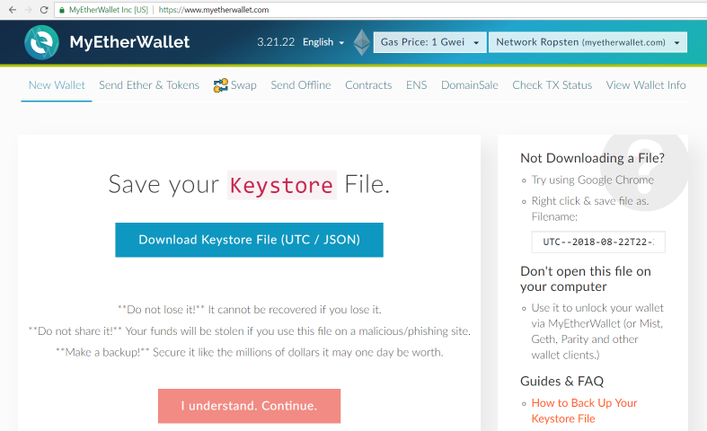

# Ethereum Wallet Encryption

To illustrate the application of **the AES cipher in action**, we shall look into one **real-world example**: the standard **encrypted wallet file format** for the **Ethereum** blockchain. We shall see how **AES-128-CTR** cipher is combined with **Scrypt** and **MAC** to securely implement authenticated symmetric key encryption by text-based password.

## Ethereum UTC / JSON Wallets

In public blockchain networks \(like Bitcoin and Ethereum\) the private keys of the blockchain asset holders are stored in special keystores, called **crypto wallets**. Typically these crypto-wallets are files on the local hard disk, encrypted by a password.

In the **Ethereum blockchain** crypto wallets are internally stored in a special **encrypted** format known as "[**UTC / JSON Wallet \(Keystore File\)**](https://theethereum.wiki/w/index.php/Accounts,_Addresses,_Public_And_Private_Keys,_And_Tokens#UTC_JSON_Keystore_File)" or "[**Web3 Secret Storage Definition**](https://github.com/ethereum/wiki/wiki/Web3-Secret-Storage-Definition)". This is the **wallet file format**, used in [**geth**](https://geth.ethereum.org) and [**Parity**](https://www.parity.io/ethereum) \(the leading protocol implementations for Ethereum\), in [**MyEtherWallet**](https://www.myetherwallet.com) \(popular online client-side Ethereum wallet\), in [**MetaMask**](https://metamask.io) \(widely used in-browser Ethereum wallet\), in the [**ethers.js**](https://github.com/ethers-io/ethers.js/) and [**Nethereum**](https://github.com/Nethereum/Nethereum) libraries and in many other Ethereum-related technologies and tools.

The Ethereum **UTC / JSON keystores** keep the **encrypted private key** \(or wallet seed words\) as **JSON text document**, specifying the encrypted data, encryption algorithms and their parameters.

## UTC / JSON Keystore - Example

Let's look into a **sample UTC / JSON keystore file**, which holds a password-protected 256-bit private key.

```javascript
{
  "version": 3,
  "id": "07a9f767-93c5-4842-9afd-b3b083659f04",
  "address": "aef8cad64d29fcc4ed07629b9e896ebc3160a8d0",
  "Crypto": {
    "ciphertext": "99d0e66c67941a08690e48222a58843ef2481e110969325db7ff5284cd3d3093",
    "cipherparams": { "iv": "7d7fabf8dee2e77f0d7e3ff3b965fc23" },
    "cipher": "aes-128-ctr",
    "kdf": "scrypt",
    "kdfparams": {
      "dklen": 32,
      "salt": "85ad073989d461c72358ccaea3551f7ecb8e672503cb05c2ee80cfb6b922f4d4",
      "n": 8192,
      "r": 8,
      "p": 1
      },
    "mac": "06dcf1cc4bffe1616fafe94a2a7087fd79df444756bb17c93af588c3ab02a913"
  }
}
```

The above JSON document is a classical example of **authenticated symmetric encryption**.

## What Is Inside the UTC / JSON File?

Typically a UTC / JSON keystore holds the following data:

* **Key-derivation function** \(KDF\) used to transform the text-based wallet encryption **password** into an AES symmetric **key**, used to encrypt the wallet contents. Usually the KDF function is "**scrypt**".
  * The **KDF parameters** - the parameters used in the KDF function to derive the password \(e.g. iterations count, salt, etc.\)
* The **ciphertext** - the encrypted wallet content \(typically holds an encrypted 256-bit private key\).
* Symmetric **cipher algorithm** + its **parameters**, e.g. **AES-128-CTR** + initial vector \(**IV**\).
* **MAC** - message authentication code used \(MAC\) to check the message integrity after it is decrypted \(to know whether the wallet decryption password was correct or not\).
  * Ethereum calculates the MAC by calculating **keccak-256** hash of the concatenations of the second-leftmost 16 bytes of the derived key together with the full **ciphertext**.
* Additional **metadata**: wallet format **version**, wallet unique **id** \(uuid\) and the blockchain **address**, controlled by this wallet.

By default the key-derivation function is scrypt and uses **weak scrypt parameters** \(n=8192 cost factor, r=8 block size, p=1 parallelization\), so it is recommended to use long and complex passwords to avoid brute-force wallet decryption attacks.

## MyEtherWallet: Play with UTC / JSON Keystore Files

To learn better the file format behind the Ethereum UTC / JSON keystore files, play with **MyEtherWallet**.



Follow the steps below to create a new **random Ethereum crypto wallet** and view its encrypted JSON content:

* Open the **MyEtherWallet** web site: [**https://myetherwallet.com**](https://www.myetherwallet.com).
* Choose a **password** and create a **new wallet**.
* Download the **Keystore File** \(UTC / JSON\).
* See **what's inside** the downloaded file.
* Try to **make some changes**, try to decrypt it with wrong password and other changes.
* Enjoy **learning by playing**.

